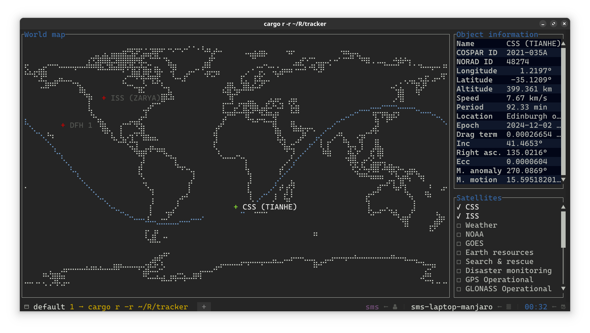

# tracker

A terminal-based real-time satellite tracking and orbit prediction application.

## Features

- **Position and trajectory**: Displays the current positions and trajectories of objects using the SGP4 model.
- **Detailed information**: Provides comprehensive details about the selected object.
- **Automatic updates**: Updates orbital elements automatically via the internet.

## License

Licensed under [Apache License, Version 2.0](LICENSE).
